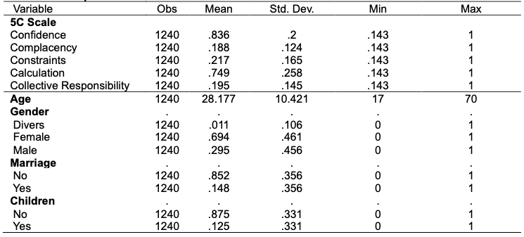

# Vaccination Attitude: 
# Peer Effect vs. Anchoring Effect

March 2022

The study explores the influence of peer/anchoring effects on vaccination attitudes during the COVID-19 pandemic 🦠. 

It addresses the hesitancy towards vaccines 💉 🩺 and the role of social norms in shaping individuals' attitudes.

Authors:  👩🏻‍💼 Trang Ton, 🙎🏼‍♂️ Niklas Brock,  👩🏻‍💼 Farida Mammadli

[Stata source code](VaccinationAttitude_Stata.do)

[Paper and survey description](VaccinationAttitudes.pdf)

### 1. Procedure

The study uses the 5C vaccination scale, which includes Confidence, Complacency, Constraints, Calculation, and Collective Responsibility as determinants of vaccination attitudes.

 📝 The 2-stage surveys were conducted online with participants from Philipps University, and divided into three treatment groups:

* "Control": questionnaires on the original 5C Scale statements and no additional stimulus factors.

* "Peer": questionnaires on the original 5C Scale statements, plus the average 5C Scale results from the Control treatment surveys as stimulus factors.

* "Anchoring": questionnaires on the original 5C Scale statements, plus the average 5C Scale results from Germany as stimulus factors.

 The Peer and Anchoring groups were shown stimulus factors in the form of  📊 graphs depicting the average 5C Scale results of previous surveys. 

 Linear regression analysis was performed to examine the relationship between the determinants of the 5C scale, demographic factors, and the treatment effects.

### 2. Data description

*Table 1: Descriptive Statistics*

There are a total of 1240 responses: 
* 722 responses - Control Treatment survey
* 277 responses - Peer Treatment Survey
* 241 responses - Anchoring Treatment survey.

The determinants of the 5C Scale are normalized from a 7-point Likert scale to a 0-1 scale.

#### 5C scale of vaccination attitude:

*Confidence*: "I am completely confident that vaccines are safe"

*Complacency*: "Vaccination is unnecessary because vaccine-preventable diseases are not common anymore"

*Constraints*: "Everyday stress prevents me from getting vaccinated"

*Calculation*: "When I think about getting vaccinated, I weigh benefits and risks to make the best decision possible"

*Collective responsibility*: "When everyone is vaccinated, I don’t have to get vaccinated, too"

### 3. Hypotheses

* Hypothesis 1: Respondents' vaccination attitudes are biased when they see the results of their peers before answering.

* Hypothesis 2: When shown the results of a large group (anchoring)  before answering, respondents' answers are biased.

* Hypothesis 3: There is a significant difference in responses among different treatments.

### Results

✅ The study supports the hypotheses that respondents' vaccination attitudes are influenced by peer effects and anchoring effects. 

✅ It also highlights the importance of demographic factors in shaping vaccination attitudes. For instance, factors like marriage, having children, and age have significant effects on vaccination attitudes.

✅ The findings contribute to understanding the dynamics of vaccine hesitancy and provide insights for designing targeted interventions to promote vaccination and mitigate the spread of infectious diseases.

### 📖 References

Betsch C, Schmid P, Heinemeier D, Korn L, Holtmann C, Bo ̈hm R (2018) Beyond confidence: Development of a measure assessing the 5C psychological antecedents of vaccination. PLoS ONE 13(12): e0208601. https://doi.org/10.1371/journal.pone.0208601

COVID-19 Snapshot Monitoring (COSMO) - www.corona-monitor.de. Retrieved from: https://projekte.uni-erfurt.de/cosmo2020/archiv/16-01/cosmo-analysis.html

